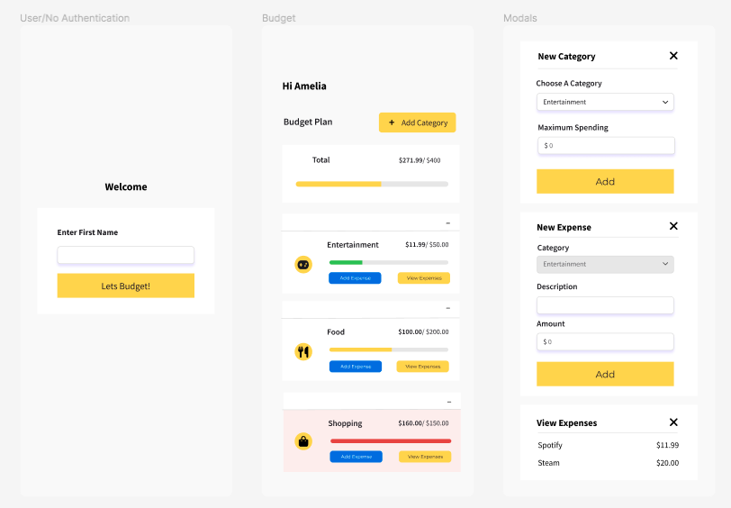
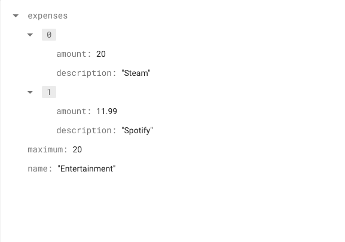

# Budget Tracker App

## Aim

A hobby project based around creating a budget app, allowing the user to set a budget limit, track their spending/expenses and categorise their budgets.

## User Interface Design

Before writing any code, I decided to come up with the app design, as an outline and indicator of the number of screens and components/features needed. Some design modifications were made further down the line.

**Here is a link to the figma design of the app:**

https://www.figma.com/file/soJq5gKdBy1h8OMoH2UXeo/Budget-App?node-id=0%3A1

### Figma Screenshot

## Goal

-   To create a minimalistic and functional UI design
-   Firebase/Firestore for database operation => IN PROGRESS

## Tech Stack Used

-   ReactJS
-   CSS
-   React Router DOM
-   Figma
-   Bootstrap

## Data Storage

**Structure of data**

### Future Implementations

-   Dark-Mode Design
-   Authentication
-   Dates and Timestamps
